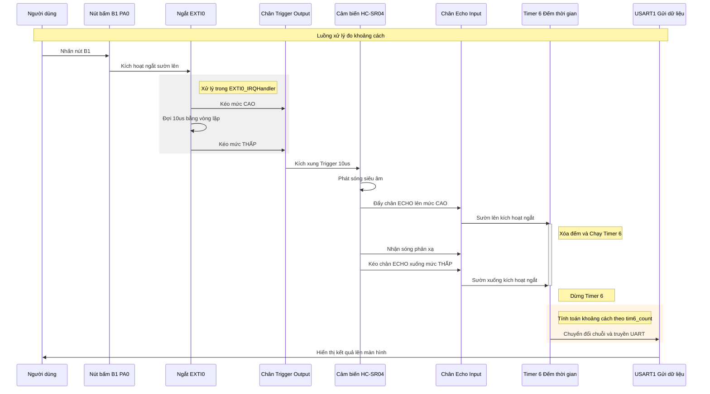

# STM32F429ZIT6 - Dự án Đo Khoảng cách với Cảm biến Siêu âm HC-SR04

Dự án này thực hiện việc đo khoảng cách bằng cảm biến siêu âm HC-SR04, sử dụng kit phát triển **STM32F429I-DISCO**. Hệ thống tận dụng tối đa cơ chế ngắt (Interrupt) và Timer để đảm bảo độ chính xác và không gây treo vi điều khiển. Cách sử dụng như sau

- Kết nối Dev-Kit với máy tính qua cổng mini USB (cổng dùng để nạp mã nguồn). 
- Dùng phân mềm serial bất kì (ví dụ <https://serial.toolhub.app/00000>) để kết nối với kit ở tốc độ **115200**
- Bấm nút B1
- xem kết quả trả về trên màn hinh Serial

## 1. Nguyên lý hoạt động

Hệ thống hoạt động dựa trên nguyên lý phản xạ sóng âm (Time of Flight):

1. **Triggering**: Vi điều khiển phát một xung mức cao (High) dài ít nhất 10µs vào chân `TRIG`.
2. **Sonic Burst**: Cảm biến HC-SR04 tự động phát ra 8 chu kỳ sóng siêu âm ở tần số 40kHz.
3. **Echo**: Chân `ECHO` của cảm biến sẽ chuyển lên mức cao. Khi nhận được sóng phản xạ trở về, chân này sẽ xuống mức thấp.
4. **Calculation**: Thời gian chân `ECHO` ở mức cao chính là thời gian sóng đi và về.
   - Công thức: `Khoảng cách = (Thời gian * 0.034) / 2` (cm).
5. **USART1 (PA9 - TX, PA10 - RX)** chính là cổng **Mini USB**

## 2. Cấu hình các chân Pin (Pinout)

Dựa trên cấu hình trong mã nguồn:

- **PA0 (User Button/B1)**: Cấu hình ngắt ngoài `EXTI0_IRQn`, chế độ `GPIO_MODE_IT_RISING` để bắt đầu quá trình đo khi nhấn nút.
- **SR04_TRIG_Pin**: Cấu hình Output tầng đẩy (Push-Pull) để kích hoạt cảm biến.
- **SR04_ECHO_Pin**: Cấu hình ngắt ngoài `EXTI15_10_IRQn`, chế độ `GPIO_MODE_IT_RISING_FALLING` để bắt được cả thời điểm bắt đầu và kết thúc xung phản hồi.
- **USART1 (PA9 - TX, PA10 - RX)**: Cấu hình tốc độ baud 115200 để truyền dữ liệu khoảng cách lên máy tính.

## 3. Thiết lập Timer 6 (TIM6)

Timer 6 được sử dụng làm bộ đếm thời gian cơ sở để đo độ rộng xung Echo:

- **Prescaler**: 8.
- **Period (ARR)**: 9.
- **Cơ chế**: Timer được cấu hình để tạo ra ngắt tràn. Trong trình phục vụ ngắt `TIM6_DAC_IRQHandler`, biến `tim6_count` sẽ tăng lên sau mỗi chu kỳ tràn.
- **Hoạt động**: Timer chỉ chạy khi chân Echo ở mức cao và dừng lại ngay khi Echo xuống mức thấp để lấy giá trị thời gian.

## 4. Thiết lập chế độ Ngắt (Interrupt)

Dự án sử dụng 3 trình phục vụ ngắt chính:

### Ngắt EXTI0 (Nút nhấn B1)

- Khi nhấn nút, vi điều khiển thực hiện kích xung `TRIG` bằng cách kéo chân lên mức cao trong khoảng 10µs thông qua một vòng lặp `while` ngắn để tạo độ trễ.

### Ngắt EXTI15_10 (Chân ECHO)

- **Khi có sườn lên (Rising)**: Reset biến đếm `tim6_count` về 0 và bắt đầu khởi chạy Timer 6 (`HAL_TIM_Base_Start_IT`).
- **Khi có sườn xuống (Falling)**: Dừng Timer 6 (`HAL_TIM_Base_Stop_IT`), lấy giá trị `tim6_count` để tính toán khoảng cách và gửi kết quả qua UART.

### Ngắt TIM6_DAC_IRQHandler

- Thực hiện tăng biến đếm thời gian `tim6_count` mỗi khi Timer 6 tràn để ghi lại thời gian trôi qua.

## 5. Kết quả hiển thị

Dữ liệu khoảng cách sau khi tính toán sẽ được định dạng thành chuỗi và gửi qua cổng UART1 với cấu trúc:
`Number: [Giá trị] cm`.

---
**Lưu ý**: Cần đảm bảo chân GND của cảm biến và Kit STM32 được nối chung để tín hiệu được ổn định.